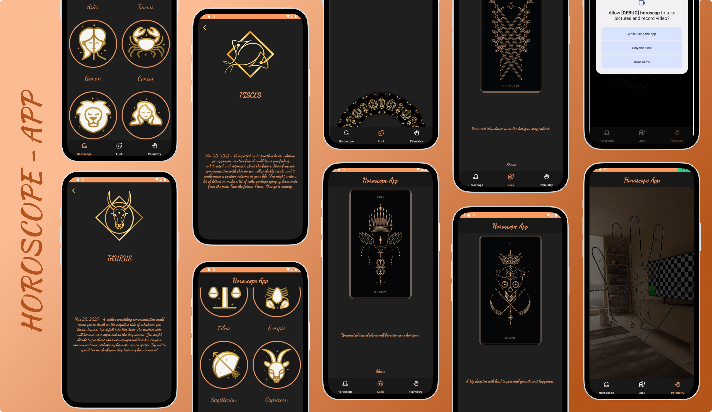

# 🍀 Horoscope App - Aplicación de Horóscopo y Lectura de Mano

**Horoscope App** es una aplicación móvil desarrollada en **Kotlin**, utilizando **MVVM** (Model-View-ViewModel) y **Clean Architecture** para garantizar un código modular, escalable y fácil de mantener. La aplicación está integrada con una **API externa de astrología** para obtener información sobre horóscopos. La aplicación ofrece varias funcionalidades astrológicas, incluyendo **horóscopos** diarios, un **Juego de la Suerte** interactivo y **Palmistry** con una cámara para capturar la mano del usuario.

<p align="center">
  
</p>

## 📌 Características

### 🔮 **Horóscopo**

- Visualiza los signos zodiacales y selecciona cualquiera de ellos para obtener más detalles sobre tu horóscopo del día.
- Animaciones suaves al navegar entre los signos y mostrar la información adicional del horóscopo.

### 🍀 **Juego de la Suerte**

- Interactúa con una rueda que gira hasta que muestra una carta de suerte, brindando un mensaje personalizado junto con una imagen que representa la carta.
- Diversión y entretenimiento con animaciones de giro de la rueda de la suerte.

### ✋ **Palmistry (Lectura de la Mano)**

- La app permite al usuario activar la cámara y capturar la mano. Actualmente, se le pide al usuario que alinee su mano con un boceto de mano proporcionado por la app.
- Esta funcionalidad aún está en desarrollo, ya que se planea implementar la lectura y análisis de la palma de la mano para generar predicciones o interpretaciones en el futuro.

## 🏗️ **Arquitectura y Diseño**

La aplicación sigue los principios de **MVVM (Model-View-ViewModel)** y **Clean Architecture**, asegurando que el código sea modular y fácil de mantener. Esto permite una clara separación de la lógica de la aplicación, la interfaz de usuario y el acceso a datos.

- **Model**: Maneja los datos, ya sea de la API o de almacenamiento local.
- **View**: Se encarga de la presentación y la interacción con el usuario.
- **ViewModel**: Sirve como un intermediario entre la vista y el modelo, gestionando los datos que se muestran en la UI y garantizando que la lógica de negocio se mantenga fuera de la interfaz de usuario.

Esta arquitectura garantiza que la app sea escalable y fácil de probar, haciendo que el código sea más robusto y mantenible a largo plazo.

## ⚙️ Tecnologías y Librerías

| Tecnologías / Librerías | Descripción |
| --- | --- |
| **Kotlin** | Lenguaje principal de desarrollo. |
| **MVVM (ViewModel, LiveData/StateFlow)** | Arquitectura utilizada para separación de lógica. |
| **Retrofit** | Biblioteca utilizada para hacer peticiones HTTP a la API externa. |
| **Glide** | Carga de imágenes eficiente. |
| **Firebase Storage** | Almacenamiento de imágenes de cartas y demás contenido visual. |
| **Camera API (CameraX)** | API para acceder a la cámara del dispositivo en la sección Palmistry. |
| **Dagger Hilt** | Inyección de dependencias. |
| **Navigation Component** | Navegación entre pantallas y uso de SafeArgs. |
| **Junit, Espresso, MockK** | Librerías para pruebas unitarias y UI. |

### Dependencias importantes de librerías:

- **Dagger Hilt** para inyección de dependencias.
- **Navigation Component** para la navegación en la app.
- **Retrofit y OkHttp** para realizar llamadas HTTP a la API externa de astrología.
- **CameraX API** para capturar imágenes de la mano del usuario.
- **Glide** para cargar imágenes eficientes en la aplicación.

---

## 📲 Instalación y Ejecución

### **1️⃣ Clonar el repositorio**

```
git clone https://github.com/tu-usuario/HoroscopeApp.git
cd HoroscopeApp
```

### **2️⃣ Abrir en Android Studio**

- Abre **Android Studio** y selecciona "Open an Existing Project".
- Elige la carpeta del proyecto y espera a que se configure.

### **3️⃣ Configuración de la API**

La aplicación utiliza una **API externa** para obtener información sobre los horóscopos. Para utilizarla en tu proyecto, sigue estos pasos:

1. Regístrate en la **API de New Astro** ([Documentación de la API](https://newastro.vercel.app/apidocs/)).
2. Obtén tu **API Key** para autenticar las solicitudes.
3. Coloca tu **API Key** en el archivo de configuración correspondiente.

### **4️⃣ Compilar y ejecutar**

- Conecta un **emulador** o un **dispositivo físico**.
- Haz clic en **Run ▶** para ejecutar la app.